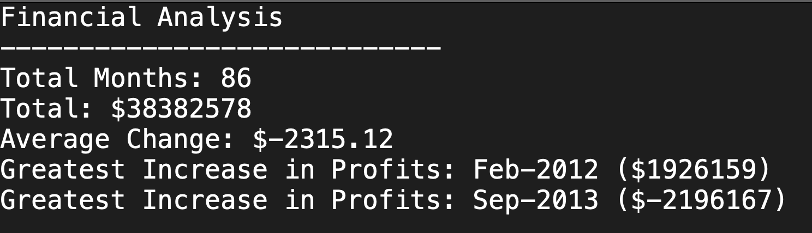
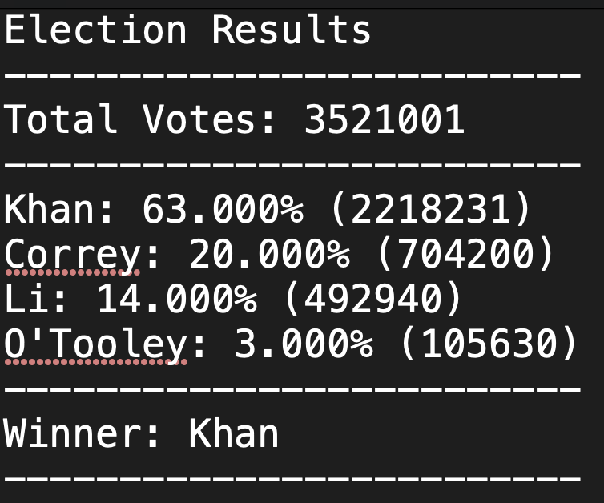

# Python Homework 
## PyBank

## **Background**
* In this challenge, you are tasked with creating a Python script for analysing the financial records of your company. You will give a set of financial data called [budget_data.csv](PyBank/Resources/budget_data.csv). The dataset is composed of two columns: `Date` and `Profit/Losses`. (Thankfully, your company has rather lax standards for accounting so the records are simple.)

* The task is to create a Python script that analyses the records to calculate each of the following:

  * The total number of months included in the dataset

  * The net total amount of "Profit/Losses" over the entire period

  * The average of the changes in "Profit/Losses" over the entire period

  * The greatest increase in profits (date and amount) over the entire period

  * The greatest decrease in losses (date and amount) over the entire period

* In addition, the final script should export the analysis to a text file with the results.

## PyPoll

* In this challenge, you are tasked with helping a small, rural town modernise its vote counting process.

* You will be give a set of poll data called [election_data.csv](PyPoll/Resources/election_data.csv). The dataset is composed of three columns: `Voter ID`, `County`, and `Candidate`. Your task is to create a Python script that analyses the votes and calculates each of the following:

  * The total number of votes cast

  * A complete list of candidates who received votes

  * The percentage of votes each candidate won

  * The total number of votes each candidate won

  * The winner of the election based on popular vote.

* In addition, the final script should export the analysis to a text file with the results.

## Copyright

© 2021 Trilogy Education Services, LLC, a 2U, Inc. brand. Confidential and Proprietary. All Rights Reserved.

## **Languages used**:
- Python

## **Python Packages Used**:
- os
- csv
  
## **Conclusions**
- 
## **Screenshots**
## **PyBank**

## **PyPoll**

## **Running the Python Scripts**
**Note: You need Python installed for this**
1. Before running any of the Python scripts please install the needed packages by running the following code in the terminal.
         
        pip install os
        pip install csv

2. Run the appropriate scripts.
  - Each task is in a seperate folder. Pybank in the folder *Pybank* and Pypoll in the folder *PyPoll*. 
  - Each of these one fscript file called *main.py* folders contain two sub folders
     
     *Analysis* - This contains the results of the analysis

     *Resources* - This contains the data file that the analysis is conducted on.

  - Set your current path to either *PyBank* or *PyPoll*.
  
  - To run the analysis, open the appropriate folder and then open the file *main.py*.
  
  - The analysis will create a *.txt* file in the folder *analysis* with the results. 
